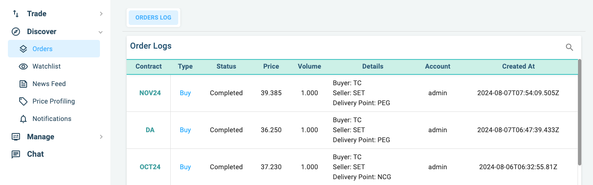
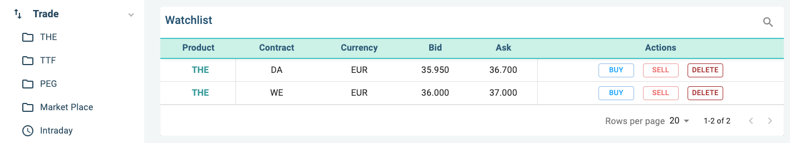
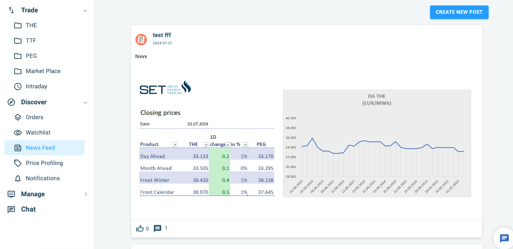
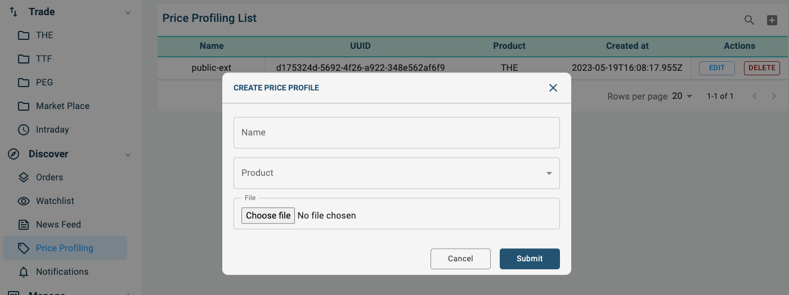
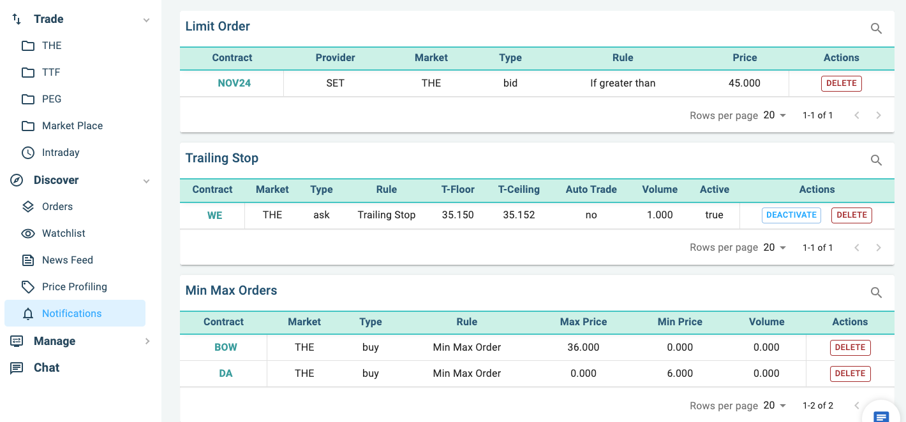

# Discover : Tools to help you use Priceblick

- :fontawesome-regular-clone: __Orders__
- :fontawesome-regular-eye: __Watchlist__ 
- :fontawesome-regular-newspaper: __News Feed__
- :fontawesome-solid-tag: __Price Profiling__
- :fontawesome-regular-bell: __Notification__

### Orders

Orders is the list of your executed orders. It should the last 100 recent orders you have made on the
system.

{ align=left : style="filter:drop-shadow(#3c3c3c 0.5rem 0.5rem 10px);max-width:900px" }

### Watchlist

Watchlist is the watchlisted items.

{ align=left : style="filter:drop-shadow(#3c3c3c 0.5rem 0.5rem 10px);max-width:900px" }

### News Feed

News feed published by all of Priceblick users.

{ align=left : style="filter:drop-shadow(#3c3c3c 0.5rem 0.5rem 10px);max-width:900px" }

### Price Profiling

Price profiling.

{ align=left : style="filter:drop-shadow(#3c3c3c 0.5rem 0.5rem 10px);max-width:900px" }

### Notification

Your notification settings.

{ align=left : style="filter:drop-shadow(#3c3c3c 0.5rem 0.5rem 10px);max-width:900px" }
