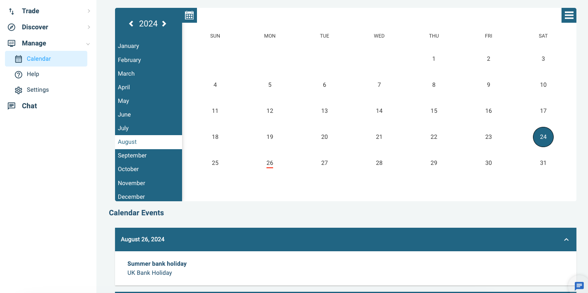
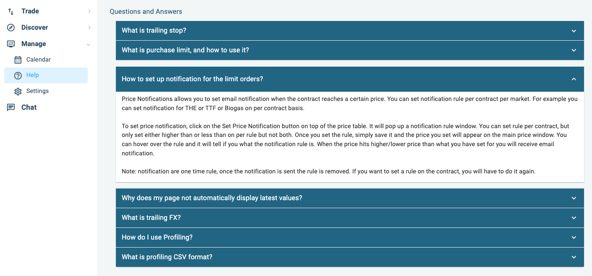
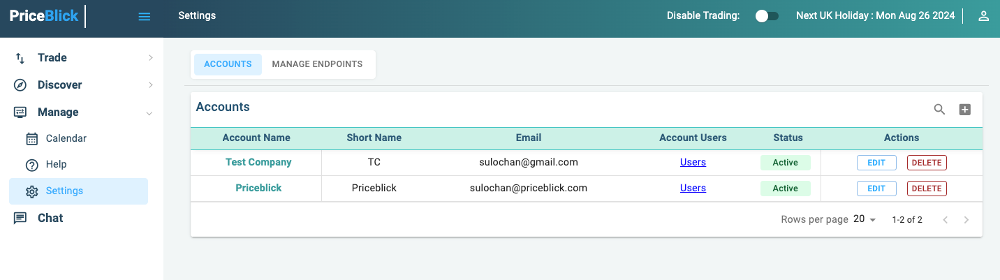

# Manage : Manage Settings

- :fontawesome-regular-calendar: __Calender__
- :fontawesome-regular-circle-question: __Help__

- :fontawesome-solid-gear: __Settings__

### Calender

Calender to mark important dates. You can see the important events on the calender.

{ align=left : style="filter:drop-shadow(#3c3c3c 0.5rem 0.5rem 10px);max-width:900px" }

### Help

Help section has FAQ.

{ align=left : style="filter:drop-shadow(#3c3c3c 0.5rem 0.5rem 10px);max-width:900px" }

### Settings

Manage accounts and users.

{ align=left : style="filter:drop-shadow(#3c3c3c 0.5rem 0.5rem 10px);max-width:900px" }

