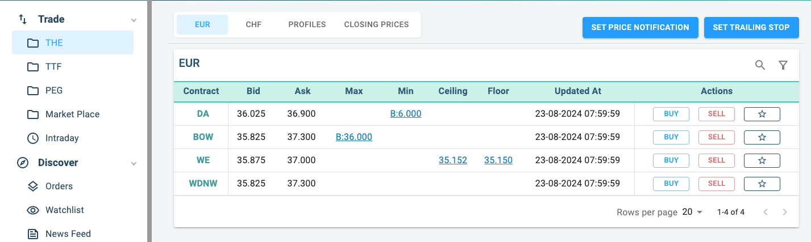
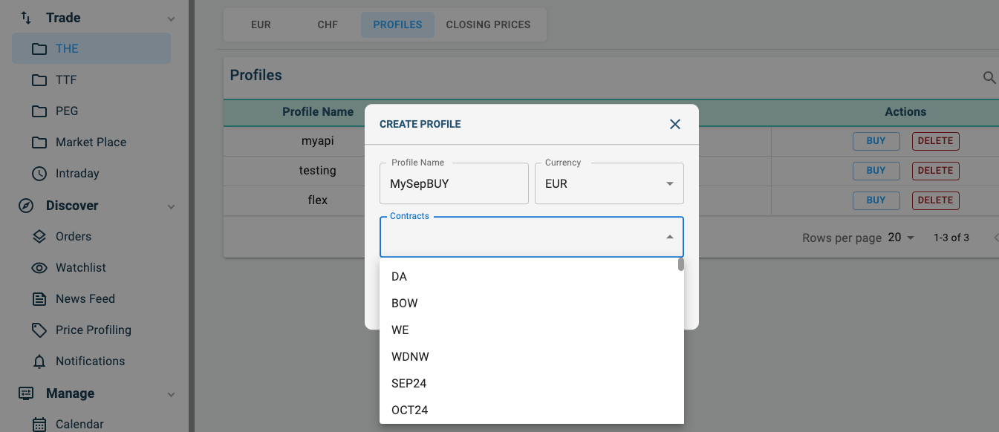
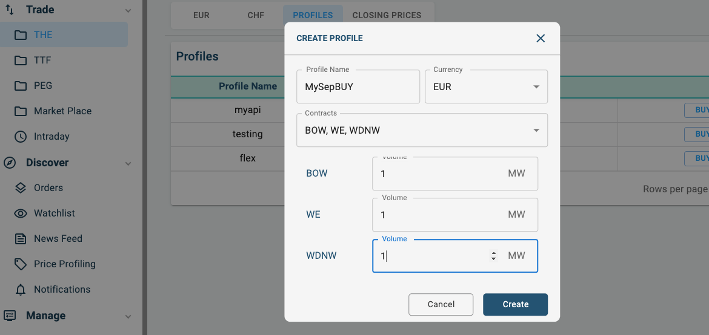
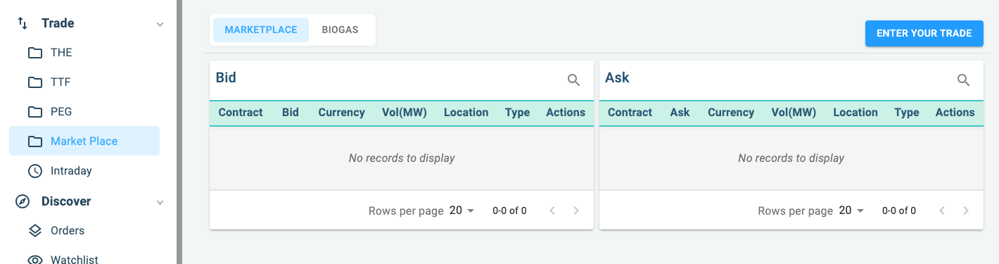
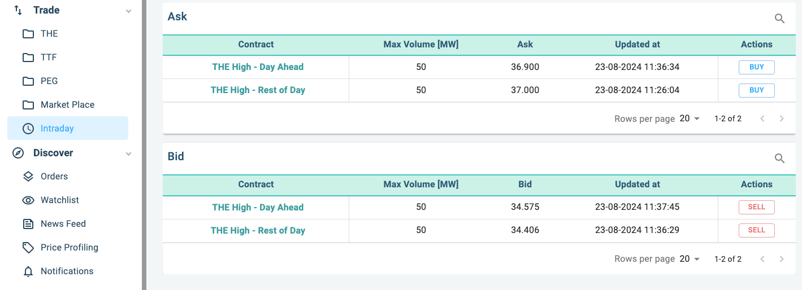

# Trade

Priceblick Trading is divided into four main sections

| Market      | Description                          |
| :---------- | :----------------------------------- |
| `THE`       | THE market data from EEX             |
| `TTF`       | TTF market data from EEX             |
| `PEG`       | PEG market data from EEX             |
| `Intraday`  | THE Intraday market data from EEX    |
| `Marketplace`  | Marketplace for SEA trading  |

### EUR and CHF contracts

{ align=left : style="filter:drop-shadow(#3c3c3c 0.5rem 0.5rem 10px);max-width:900px" }

THE is the most prominent market with both `EUR` and `CHF` prices.

There is also option to create a profile to trade. Profiles makes it easier to trade contracts that is frequenly
bought and sold by a client.

### Profiles

{ align=left : style="filter:drop-shadow(#3c3c3c 0.5rem 0.5rem 10px);max-width:900px" }

Profile is a collection of contracts frequently bought and sold by you. It allows you to define the frequently used
strategy to be place in one group so that you dont have to buy/sell multiple times.

To create a profile, simply click on the `+` button on the profile section.

Give your profile a name, choose the right currency and select one or more contracts, then add the volume you
want and hit create.

{ align=left : style="filter:drop-shadow(#3c3c3c 0.5rem 0.5rem 10px);max-width:900px" }

Buying profile is simply a matter of selecting the BUY button for the profile that you wish to buy. An email with the confirmation
will be sent as the buy process is triggered.

### Closing Prices

Priceblick provides closing prices for all contracts for `THE`. These are csv file that you can access by clicking on the cosing prices
tab and download the csv for the relavent dates that you want.

### Marketplace

Marketplace is a platform for Swiss players to place their available / requested quantities for a defined period on SEA. The orders will be displayed to all Priceblick users. They can click and trade and  enter into relevant transaction with their shareholder. Confirmation will be sent to by e-mail.

{ align=left : style="filter:drop-shadow(#3c3c3c 0.5rem 0.5rem 10px);max-width:900px" }

### Intraday

Intraday market provides intraday prices from `RWE` and `EEX` for clients to trade.

{ align=left : style="filter:drop-shadow(#3c3c3c 0.5rem 0.5rem 10px);max-width:900px" }
